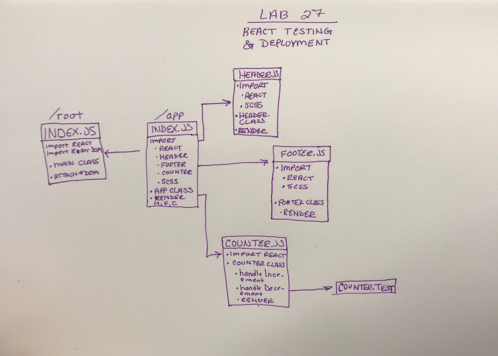

# lab-27-react-testing-and-deployment
Lab 27: React Testing And Deployment

### Author: Chloie Parsons 

## Links and Resources
* [Submission PR](https://github.com/chloieparsons-401-advanced-javascript/lab-27-react-testing-and-deployment/pull/1)
* [Travis](https://www.travis-ci.com/chloieparsons-401-advanced-javascript/-react-testing-and-deployment)
* [Netlify](https://vigilant-perlman-a64d05.netlify.com/)


## Modules

## Running the app
* ```npm i``` (to install dependencies)

* ```npm run start``` 

## Tests
* ```npm run test```
* ```npm run test-watch```
* ```npm run lint```

## UML
